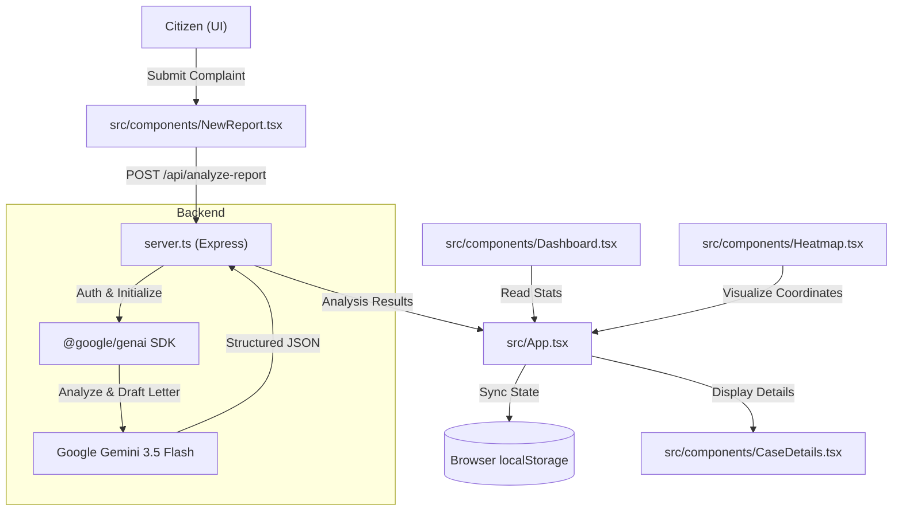

<div align="center">

</div>

## 1. What is this repo?

The `radmm/nagarikdesu` repository contains the source code for **NagarikAI**, a civic advocacy platform designed to bridge the gap between citizens and municipal authorities in Bengaluru, India. The application's primary function is to transform informal citizen complaints (submitted via text or voice) into professionally formatted, legally-coded formal letters addressed to specific government departments.

At its core, the project acts as an automated legal drafting engine. When a user describes a public hazard; such as a pothole, a water main burst, or an illegal dumping site—the system uses Large Language Models (LLMs) to:
1.  **Categorize** the issue into specific domains like "Roads & Infrastructure" or "Public Safety & Law."
2.  **Assess Urgency** (Routine, Medium, Urgent, or Critical).
3.  **Route** the complaint to the correct authority, such as the BBMP (Bruhat Bengaluru Mahanagara Palike) or BESCOM (Bangalore Electricity Supply Company).
4.  **Generate a Formal Letter** that references relevant municipal codes or statutory duties of care, making the complaint more actionable for officials.

The repository includes a full-stack implementation featuring a React-based frontend for reporting and tracking, and a Node.js/Express backend that integrates with Google's Gemini AI for natural language processing.

## 2. How all main components connect

The architecture is a classic client-server model with an external AI integration. The frontend is a Single Page Application (SPA) that manages user state, multi-language support (English, Kannada, Hindi), and geographic visualization. The backend serves both as an API for AI analysis and as a static file server for the production build.

### Data Flow for a New Report
1.  **Intake:** The user interacts with `src/components/NewReport.tsx`. They can type a description or use a simulated voice input.
2.  **Location Sensing:** The application uses the browser's Geolocation API to pinpoint coordinates, then performs reverse geocoding via OpenStreetMap (Nominatim) to identify the specific ward or zone.
3.  **Analysis Request:** The frontend calls the `/api/analyze-report` endpoint on the Express server (`server.ts`).
4.  **AI Inference:** The server sends a structured prompt to the Google Gemini API. The prompt, defined in `server.ts`, instructs the AI to act as a "legal-expert civic advocacy agent."
5.  **Schema Enforcement:** The AI returns a JSON object following a strict schema defined in the backend, ensuring consistent data for the frontend (title, category, urgency, department, and the formal letter text).
6.  **Persistence:** The frontend receives the analysis, creates a new `CivicReport` object (defined in `src/types.ts`), and saves it to the browser's `localStorage` for persistence across sessions.



## 3. Repository Structure

```shell
nagarikdesu/
├── assets/
│   └── .aistudio/
├── package.json
├── server.ts
├── src/
│   ├── App.tsx
│   ├── components/
│   │   ├── Authorities.tsx
│   │   ├── BottomNav.tsx
│   │   ├── CaseDetails.tsx
│   │   ├── CaseList.tsx
│   │   ├── Dashboard.tsx
│   │   ├── Heatmap.tsx
│   │   ├── NewReport.tsx
│   │   ├── NotificationsScreen.tsx
│   │   └── Sidebar.tsx
│   ├── data.ts
│   ├── index.css
│   ├── main.tsx
│   ├── translations.ts
│   └── types.ts
├── tsconfig.json
├── vite.config.ts
├── .env.example
├── index.html
└── README.md
```

a. Wireframe / Mock Diagram

```
+---------------------------------------------------------------------------------+
| [ Logo: Nagarikdesu ]  [ Motto: Voice for Bengaluru ]     [ EN | ಕನ್ನಡ | हिंदी ] |
+---------------------------------------------------------------------------------+
| Sidebar (Desktop) | Main Content Area                                           |
|                   |                                                             |
| [ ] Dashboard     |  +-------------------+  +-------------------+               |
| [ ] Heatmap       |  | Total Cases: 12   |  | Pressure Score: 85 |               |
| [ ] My Cases      |  +-------------------+  +-------------------+               |
| [ ] Authorities   |                                                             |
| [ ] Notifications |  +-------------------------------------------------------+  |
|                   |  | [ Button: + Report New Issue ]                        |  |
|                   |  +-------------------------------------------------------+  |
|                   |                                                             |
|                   |  +-------------------------------------------------------+  |
|                   |  | Active Reports Feed                                   |  |
|                   |  | > #REP-001: Pothole at Indiranagar (Urgent)           |  |
|                   |  | > #REP-002: Water Leakage at Koramangala              |  |
|                   |  +-------------------------------------------------------+  |
|                   |                                                             |
+-------------------+-------------------------------------------------------------+
| Bottom Nav (Mobile): [ Dashboard ] [ Map ] [ + ] [ Cases ] [ Alerts ]           |
+---------------------------------------------------------------------------------+
```

b. Architecture Diagram

The system architecture follows a request-response flow centered around AI-driven analysis.


c. Key Architectural Details

Frontend (React/Vite):

Located in src/.
Uses a single-page architecture where the tab state in src/App.tsx controls which component is rendered.
Styles are managed via Tailwind CSS with a dark-mode "glassmorphism" aesthetic.
Backend (Express):

Defined in server.ts.
Acts as a bridge to the Gemini AI API to prevent exposing API keys on the frontend.
Includes a Graceful Fallback: If the Gemini API fails or no key is provided, the server returns a pre-defined mock response (mockFallbackResponse) so the app remains functional for testing.
AI Engine:

The backend uses a system prompt that instructs Gemini to act as a legal-expert civic advocacy agent.
It enforces a strict JSON schema requiring a title, category, urgency, department assignment, and a formal legal letter referencing municipal codes.
Persistence:

There is no external database (like PostgreSQL or MongoDB). All user reports are persisted locally in the user's browser using localStorage (managed in src/App.tsx).


## 4. Other important information

### Technology Stack
*   **Frontend Framework:** React 19 with TypeScript.
*   **Build Tooling:** Vite 6 for the frontend development and HMR, and `esbuild` for bundling the `server.ts` into a production-ready CJS file (`dist/server.cjs`).
*   **Styling:** Tailwind CSS (using the `@tailwindcss/vite` plugin) for a modern, high-contrast "dark mode" aesthetic with significant use of backdrop blurs and ambient glow effects.
*   **AI Integration:** `@google/genai` SDK targeting the `gemini-3.5-flash` model.
*   **Icons:** `@phosphor-icons/react` and `lucide-react`.
*   **Mapping:** Leaflet (`leaflet`) for the interactive heatmap and issue density visualization.
*   **Animations:** Framer Motion (`motion`) for smooth transitions between dashboard tabs.

### Key Logic and Features
*   **Localization:** `src/translations.ts` provides a comprehensive mapping for English, Kannada, and Hindi. The system doesn't just translate UI labels; it provides a framework for the AI to understand and generate content relevant to the local context.
*   **Prompt Engineering:** In `server.ts`, the system uses a sophisticated system prompt that defines available departments (BBMP, BWSSB, BESCOM, Police) and specific statutory duties. It includes logic to set a `needsHumanReview` flag if the input is ambiguous or contains swearing.
*   **Graceful Fallbacks:** The `server.ts` file includes a `mockFallbackResponse`. If the `GEMINI_API_KEY` is missing or the API call fails, the system still returns a functional, Bengaluru-specific response to allow for development and testing without active API credits.
*   **Bento-style Dashboard:** `src/components/Dashboard.tsx` implements a modern grid layout displaying "Community Pressure" scores (a simulated metric of how many citizens support a specific case) and "Priority Indexes."

### Setup and Configuration
To run the project, developers need to configure environment variables as shown in `.env.example`:
1.  `GEMINI_API_KEY`: A valid API key from Google AI Studio.
2.  `APP_URL`: The base URL for the application.

Commands:
*   `npm install`: Install dependencies.
*   `npm run dev`: Starts the server using `tsx` (TypeScript Execute) which runs `server.ts`. The server then handles both the API and the Vite middleware for the frontend.
*   `npm run build`: Compiles the frontend via Vite and the backend via `esbuild`.
